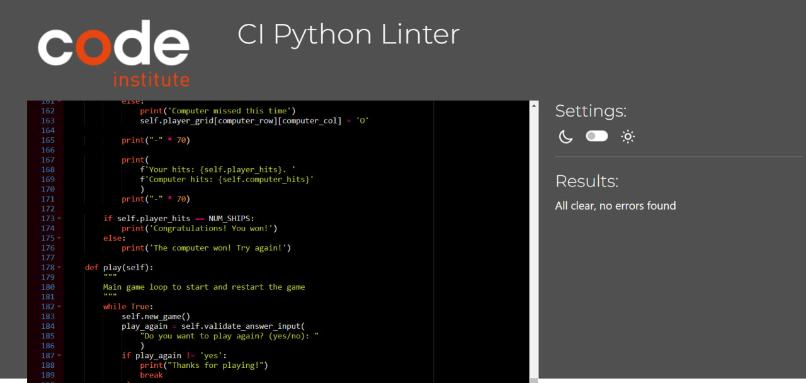

# TESTING
I have manually tested this project by doing the following:
+ ### PEP8 Python Validator testing
    Passed the code through a PEP8 linter and confirmed there are no problems.
    
+ ### Invalid Input Handling
    + Given strings when numbers are expected to ensure the program handles non-integer inputs gracefully.
    + Entered out-of-bounds inputs (numbers outside the grid size) to test the input validation.
    + Provided the same input twice to check for proper handling of repeated moves.
+ ### Gameplay Testing
    Played multiple rounds in both my local terminal and the Code Institute Heroku terminal to ensure the game runs smoothly and as expected under different scenarios.

## Bugs
### Solved bugs
+ ### Invalid Input Handling:
    + The program failed to properly handle invalid inputs, such as strings when numbers were expected or out-of-bounds numbers. This issue was fixed by refining the input validation logic to correctly prompt the user until valid input was provided.
+ ### Incorrect Hit Detection:
    + There was an issue with detecting hits and misses where the game did not always register the correct result. This was caused by improper handling of grid coordinates. I resolved this by carefully validating and updating the grid cells, ensuring that the correct cells were marked as hits or misses based on the game rules.

## Remaining Bugs
+ no bugs remaining
